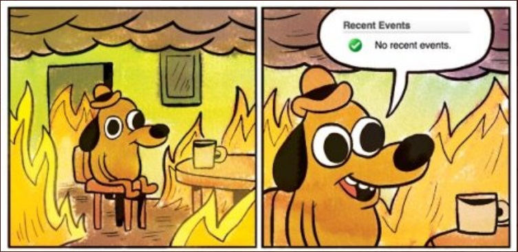

# Go Lang Quest: Learning Journey

This repo is my Go practice log: start with tiny CLIs, then level up into SRE chaos drills. Think of it like shipping to `us-east-1` on a Friday: small changes, fast feedback, and the occasional chaos button.

*Status check vibes, nothing to see here.*

## Quest map

- `Go Lang Quest 0/Chapter1`: first Go binary; prints "Go Infra Quest: Level 0. GG Noobs!" for a clean hello world rep.
- `Go Lang Quest 0/Chapter2`: adds the `flag` package with a `-level` switch to control output and get used to CLI ergonomics.
- `Go Lang Quest 1/madao_api`: HTTP healthcheck service with chaos toggles (latency + failures), graceful shutdown, and bilingual status lines so I can rehearse golden signals and brownout vs outage behavior. (GPT Coded lol.)

## Run fast

- Prereqs: Go 1.21+ installed.
- Level 0 hello world: `cd "Go Lang Quest 0/Chapter1" && go run .`
- Flag drill: `cd "Go Lang Quest 0/Chapter2" && go run . -level 3`
- Calm Madao API: `cd "Go Lang Quest 1/madao_api" && go run . -name "Madao API" -port 8080`
- AWS chaos drill: `go run main.go -chaos -fail-pct 20 -slow-pct 30 -max-delay-ms 1200 -slow-threshold-ms 800 -persistent=true`; good for rehearsing partial-AZ or dependency brownouts. `/health` returns `ok`, `degraded`, or `madao_spiral` with request ids for tracing.

## What I'm practicing

- Go basics: modules, `main`, `fmt.Println`, and `flag` usage.
- SRE lens: golden signals from `/health`, tracing via `request_id`, and comparing detailed vs minimal error bodies for MTTR impact.
- Resilience drills: tuning chaos flags to practice timeouts, retries, backoff, and circuit breakers; same vibes as toggling multi-AZ after the status page goes orange.
- Ops discipline: graceful shutdown on Ctrl+C/SIGTERM, logging startup config, and keeping defaults safe.

## Next experiments

- Add lightweight tests around `/health` to lock in degraded vs failure logic.
- Package `madao_api` into a container and run chaos drills behind a local ALB-style reverse proxy.
- Stream metrics to a faux CloudWatch (Prometheus or OpenTelemetry) to graph latency/error budgets.
- Write a short runbook for "When us-east-1 sneezes" scenarios using the chaos presets above.
